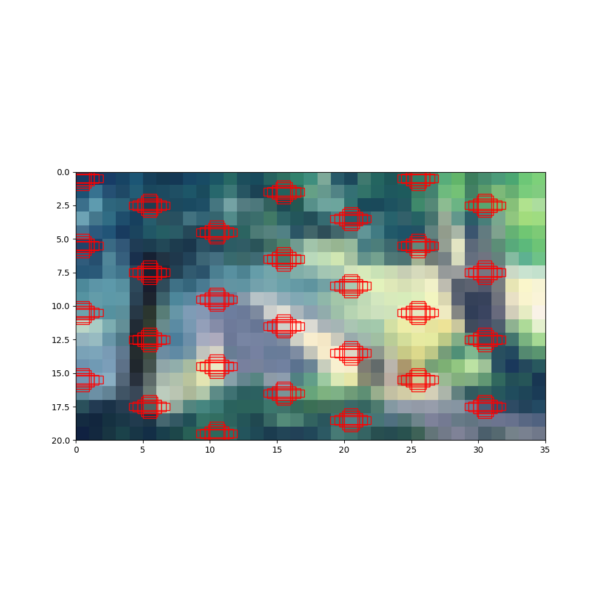

# Single Shot Multibox Detector (SSD)

This is an SSD model implemented using Python/PyTorch from scratch, i.e. no model except for the ResNet-50 backbone was imported. Comments and documentation are included to not only help with my own understanding but also potentially help anybody reading the code. 

### Usage

TODO: complete after full functionality is implemented

### Visualize Anchor Boxes

Create a .env file with a variable named `TEST_IMG` and set it to the location of the desired image file, then simply run `python anchor_visual.py` in your terminal or run it in your IDE. Note that the visuals are created after downsizing the image, as the anchor boxes will be too small to see on big images, although this will not overwrite the original file. The output will be saved to `/img/anchor_visualization.png`. If the `img` folder doesn't exist, it will create one automatically.

    

*Note:* The `motion(ignore)` folder has nothing to do with the actual SSD model, it's just there for me to explain my thought process behind why I chose to do this project.